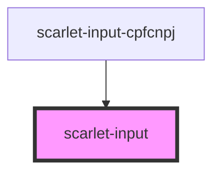

# scarlet-input

<!-- Auto Generated Below -->

## Properties

| Property          | Attribute          | Description | Type                                                                         | Default     |
| ----------------- | ------------------ | ----------- | ---------------------------------------------------------------------------- | ----------- |
| `disabled`        | `disabled`         |             | `boolean`                                                                    | `false`     |
| `errormessage`    | `errormessage`     |             | `string`                                                                     | `undefined` |
| `helpermessage`   | `helpermessage`    |             | `string`                                                                     | `undefined` |
| `iconDescription` | `icon-description` |             | `string`                                                                     | `undefined` |
| `iconFilename`    | `icon-filename`    |             | `string`                                                                     | `undefined` |
| `idprop`          | `idprop`           |             | `string`                                                                     | `undefined` |
| `label`           | `label`            |             | `string`                                                                     | `undefined` |
| `mask`            | `mask`             |             | `"" \| "CEP" \| "CNPJ" \| "CPF" \| "CPFCNPJ" \| "CURRENCY"`                  | `''`        |
| `maxlength`       | `maxlength`        |             | `number`                                                                     | `undefined` |
| `name`            | `name`             |             | `string`                                                                     | `undefined` |
| `readonly`        | `readonly`         |             | `boolean`                                                                    | `false`     |
| `required`        | `required`         |             | `boolean`                                                                    | `false`     |
| `type`            | `type`             |             | `"date" \| "email" \| "number" \| "password" \| "search" \| "tel" \| "text"` | `'text'`    |
| `value`           | `value`            |             | `string`                                                                     | `''`        |

## Events

| Event     | Description | Type                   |
| --------- | ----------- | ---------------------- |
| `changed` |             | `CustomEvent<UIEvent>` |

## Dependencies

### Used by

 - [scarlet-input-cpfcnpj](../scarlet-input-cpfcnpj)

### Graph

----------------------------------------------

*Built with [StencilJS](https://stenciljs.com/)*
