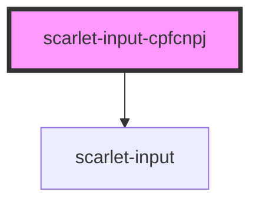

# scarlet-input-cpfcnpj

<!-- Auto Generated Below -->

## Properties

| Property        | Attribute       | Description | Type      | Default     |
| --------------- | --------------- | ----------- | --------- | ----------- |
| `disabled`      | `disabled`      |             | `boolean` | `false`     |
| `errormessage`  | `errormessage`  |             | `string`  | `undefined` |
| `helpermessage` | `helpermessage` |             | `string`  | `undefined` |
| `idprop`        | `idprop`        |             | `string`  | `undefined` |
| `label`         | `label`         |             | `string`  | `undefined` |
| `name`          | `name`          |             | `string`  | `undefined` |
| `readonly`      | `readonly`      |             | `boolean` | `false`     |
| `required`      | `required`      |             | `boolean` | `false`     |
| `value`         | `value`         |             | `string`  | `undefined` |

## Dependencies

### Depends on

- [scarlet-input](../scarlet-input-base)

### Graph

----------------------------------------------

*Built with [StencilJS](https://stenciljs.com/)*
